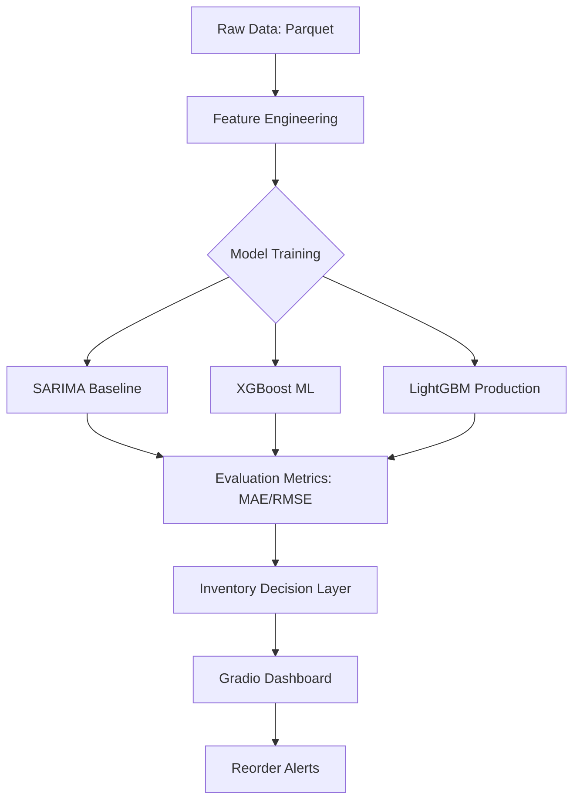
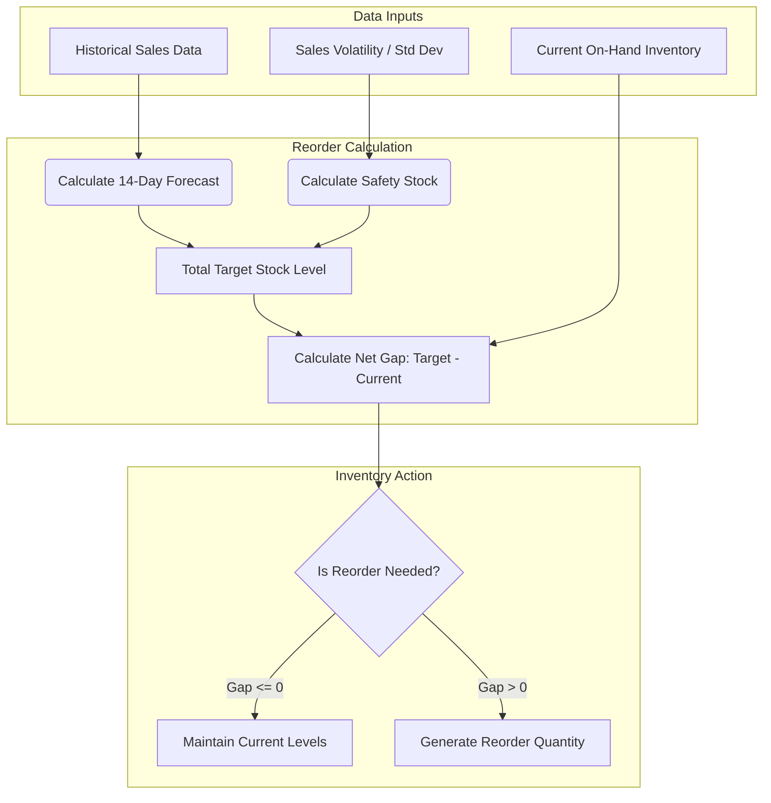
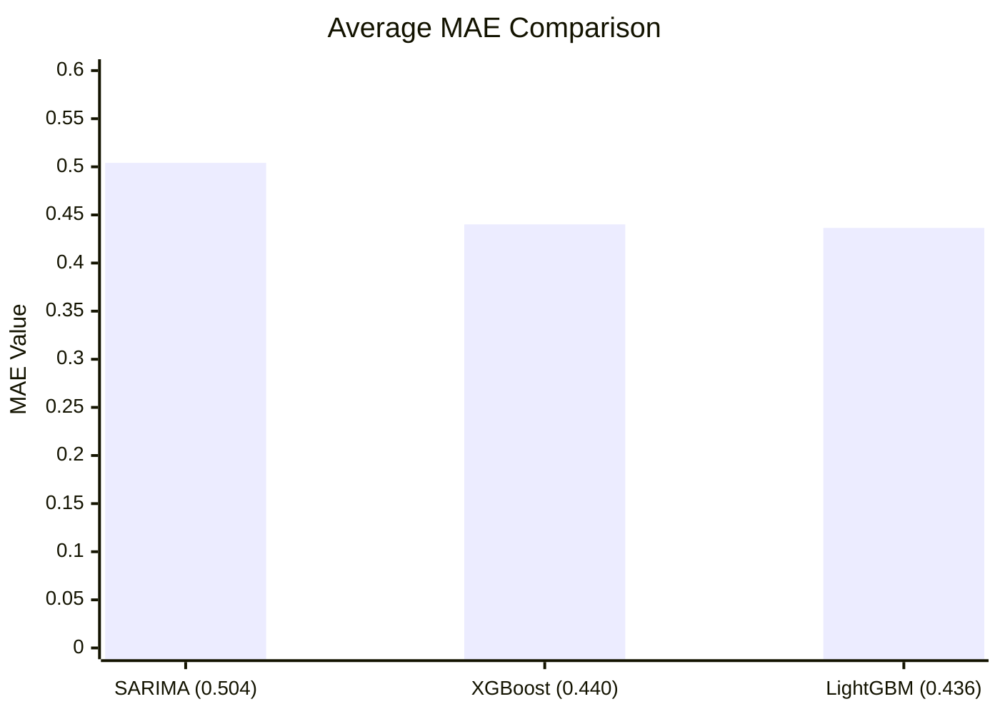

<div align="center">
  
  <h1>Stock-Wise</h1>
  <p><strong>AI-Driven Demand Forecasting & Inventory Optimization System</strong></p>

  <p align="center">
    
    
    
    
  </p>
</div>

---

## 📋 Project Overview
**Stock-Wise** is a production-grade machine learning system designed to solve the critical business problem of inventory imbalance. By predicting daily demand at the SKU-store level, the system empowers retailers to transition from "gut-feeling" ordering to **automated, data-driven replenishment**.

### The Business Problem
Retailers lose billions annually to **stockouts** (lost sales) and **overstocking** (wasted capital/spoilage). Stock-Wise addresses this by integrating historical sales with external signals like weather and promotions to create highly accurate 14-day forecasts.

## 🚀 Key Features
- **Multi-Model Benchmarking**: Automated comparison between Statistical (SARIMA) and ML (XGBoost, LightGBM) models.
- **Exogenous Signal Integration**: Incorporates weather patterns, holiday effects, and promotion flags.
- **Inventory Decision Layer**: Dynamic safety stock and reorder quantity calculations.
- **Risk Dashboard**: Interactive Gradio UI for model performance and inventory alerts.

## 📊 Dataset Description
The system utilizes real-world, anonymized retail data:
- **Scope**: 4.5M+ records covering various SKUs across multiple management groups.
- **Features**: Daily sales, hourly stock levels, discount rates, and temporal markers.
- **Weather Data**: Integrated precipitation, temperature, and humidity metrics per region.

## 🏗️ System Architecture

---

## 🔬 Models & Performance
The project implements a tiered modeling approach to justify the selection of the final production model.

| Model | Avg MAE (Unit Error) | Avg RMSE | Logic/Use Case |
| :--- | :--- | :--- | :--- |
| **SARIMA** | 0.5041 | 0.6239 | Baseline for seasonal trends. |
| **XGBoost** | 0.4402 | 0.5450 | Non-linear ML benchmark. |
| **LightGBM** | **0.4365** | **0.5529** | **Selected Production Model.** |

**Why LightGBM?**
LightGBM was chosen for its leaf-wise growth strategy, which handled the high-cardinality SKU data and exogenous features with superior training speed and the lowest unit-level error (MAE).

---

## ⚙️ Feature Engineering
To maximize accuracy, the following features were engineered:
- **Lag Features**: (T-1, T-7, T-14) to capture historical momentum.
- **Rolling Statistics**: 7 and 14-day moving averages to smooth volatility.
- **Environmental Signals**: Temperature and rain indicators to adjust for weather-driven foot traffic.
- **Inventory Flags**: Identifying past stockouts to prevent "zero-sale" bias in the model.

## 📦 Inventory Reorder Logic
The system translates ML forecasts into operational decisions using:
1. **Forecast Horizon**: 14-day cumulative demand prediction.
2. **Safety Stock**: Calculated using demand standard deviation and service level targets.
3. **Reorder Qty**: `(Forecasted Demand + Safety Stock) - Current Inventory`.

### Model Performance Comparison
- **MAE (Mean Absolute Error)**: Chosen as the primary metric for interpretability (average unit error per SKU).

- **RMSE**: Used to penalize large outliers in demand spikes.
 ```mermaid
xychart-beta
    title "Average RMSE Comparison"
    x-axis ["SARIMA (0.624)", "XGBoost (0.545)", "LightGBM (0.553)"]
    y-axis "MAE Value" 0 --> 0.6
    bar [0.6239, 0.5450, 0.5529]

```
- **MAPE**: Calculated but not emphasized due to instability with zero-sale days in sparse retail data.


---

## 🖥️ Dashboard & Insights
The integrated **Gradio Dashboard** provides:
- **Model Leaderboards**: Direct MAE/RMSE comparisons.
- **Forecast Viz**: Predicted vs. Actual sales overlays.
- **Actionable Alerts**: "🔴 LOW STOCK" alerts for immediate reordering.

## 🛠️ Technologies Used
- **Python** (Pandas, NumPy, Scikit-learn)
- **Gradient Boosting** (LightGBM, XGBoost)
- **Time-Series** (Statsmodels SARIMA)
- **Deployment** (Gradio, Plotly)
- **Data Storage** (Apache Parquet)

## 🏃 How to Run
1. **Clone**: `git clone https://github.com/your-repo/stock-wise.git`
2. **Install**: `pip install pandas pyarrow lightgbm xgboost gradio plotly`
3. **Execute**: Run `StockWise.ipynb` to train models and launch the UI.

## 🔮 Future Improvements
- **Clustering**: Grouping SKUs by velocity (Fast vs. Slow moving) for specialized model tuning.
- **Deep Learning**: Implementing Temporal Fusion Transformers (TFT).
- **Optimization**: Multi-echelon inventory optimization for warehouse-to-store logic.
